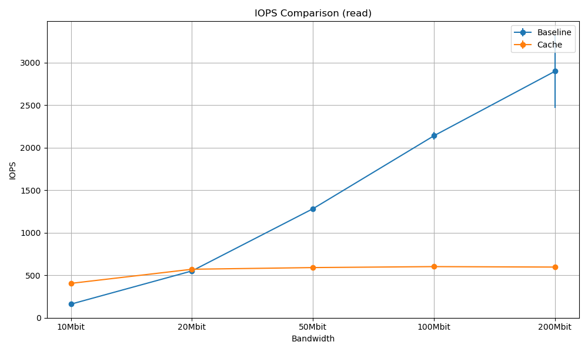
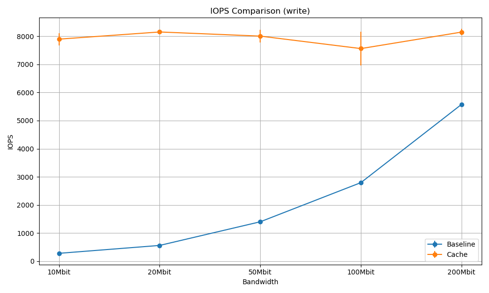
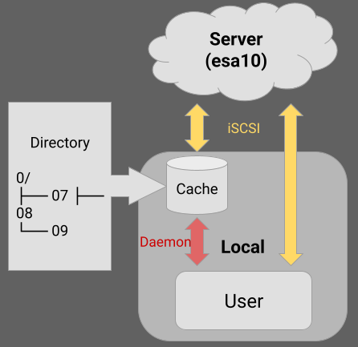
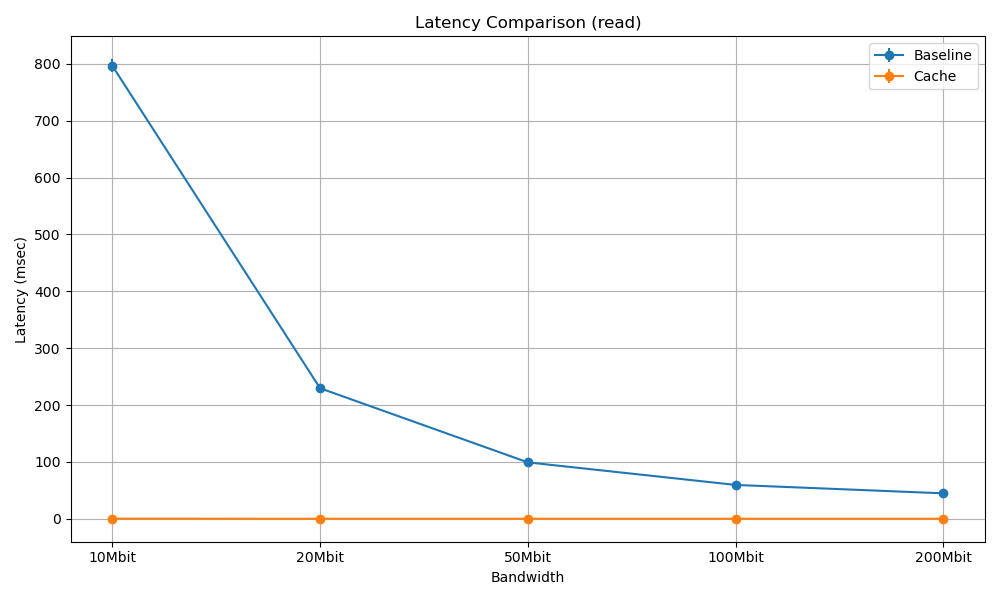
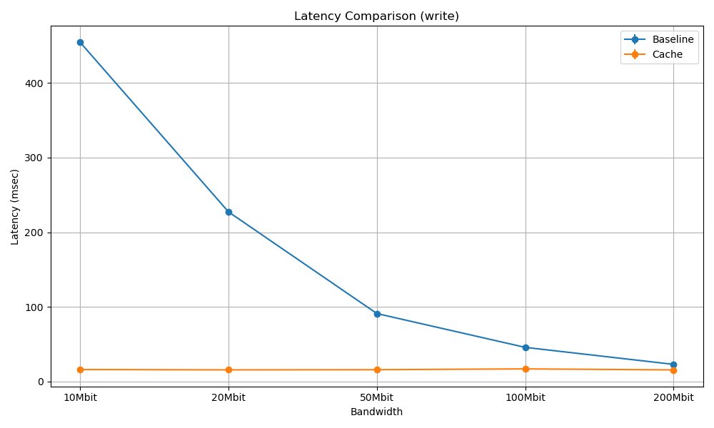
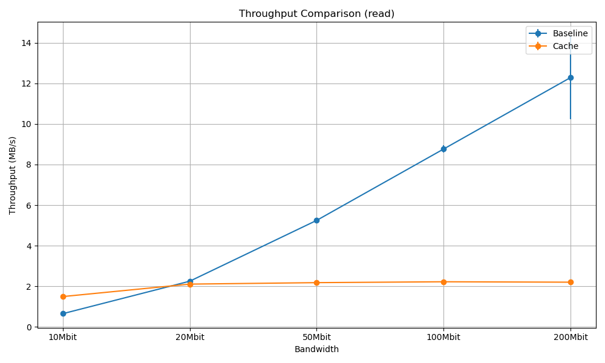
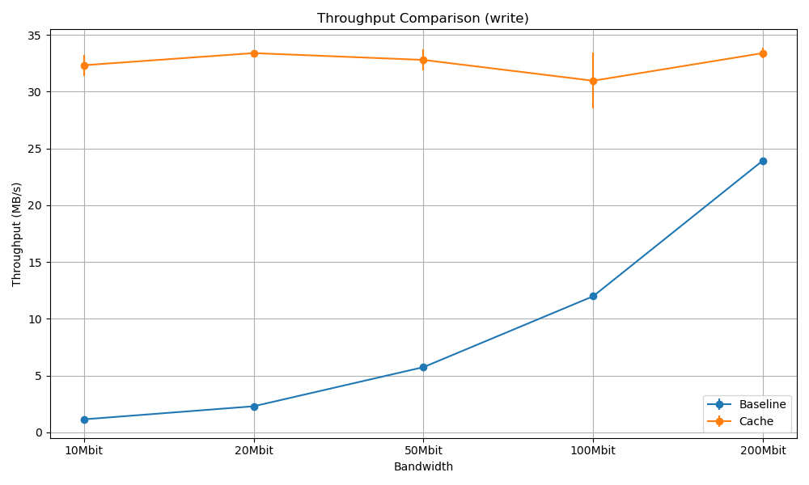

# Block-Level Persistent Write-Back Cache System for Remote Storage Systems

This project implements a secure, high-performance write-back caching layer for remote block devices accessed over iSCSI. Designed to reduce latency and decouple application performance from network bandwidth, the system uses local storage and intelligent caching to serve hot data and asynchronously flush dirty blocks.

  


## Features

- Write-back caching with dirty-bit tracking and asynchronous flush
- LRU eviction policy using a timestamped min-heap
- Encrypted communication via IPsec with AES-256
- Crash-resilient cache rebuild on restart
- Block-level storage via BUSE
- Multithreaded I/O with eviction and flushing coordination

## System Architecture

- Client device uses BUSE to mount a virtual block device
- Cache manager stores hot blocks locally (4KB per file + metadata)
- Flush thread writes dirty blocks to remote disk asynchronously
- Remote server is exposed via iSCSI, secured by IPsec




## Performance Overview

| Bandwidth | Read IOPS (Cache vs Baseline) | Write IOPS (Cache vs Baseline) |
|-----------|-------------------------------|--------------------------------|
| 10Mbit    | 538 vs 160                    | 2697 vs 280                    |
| 20Mbit    | 824 vs 546                    | 2700 vs 561                    |
| 50Mbit    | 794 vs 1264                   | 2662 vs 1401                   |
| 100Mbit   | 838 vs 2003                   | 2630 vs 2777                   |
| 200Mbit   | 814 vs 2920                   | 2641 vs 5555                   |

### Key Insights

- Up to 3× faster reads and 10× faster writes under low-bandwidth conditions
- Stable write latency across all bandwidths due to deferred flushing
- Performance degrades when network is no longer the bottleneck

  
  
  


## Test Setup

- Platform: Ubuntu 22.04.5 LTS
- Tools: C, BUSE, pthreads, fio, tc, IPsec
- Workload: Zipf-distributed I/O over 60s runs
- Cache/Server Size: 50GB/200GB

## Project Structure

```
.
├── buse\_main.c           # Registers block device and starts I/O loop
├── cache.c               # Cache logic (read, write, LRU, flushing)
├── heap.c / heap.h       # Min-heap and timestamped eviction
├── logger.c              # Logging utility
├── rebuild.c             # Cache recovery on restart
├── ipsec.sh              # IPsec setup (AES-256 transport mode)
├── test/                 # Benchmarks, log parsers, FIO scripts
├── cache\_logs/           # Ignored in .gitignore (large logs)
└── README.md
```

## Secure Communication

All I/O between client and server is encrypted with IPsec (AES-256) using pre-shared keys. We validated the encryption using:

- `ip xfrm` state inspection
- `tcpdump` to confirm encrypted traffic

## Known Limitations

- Single-threaded flushing limits scalability at high throughput
- Global mutex locking introduces contention
- Deep directory structure causes filesystem latency
- Cache overhead exceeds benefits at high bandwidths

## Future Work

- Parallelize flushing thread
- Refactor locking strategy for heap/file access
- Optimize metadata layout and eviction heuristics
- Build user tools for real-time monitoring and tuning

## Authors

- Jen-Hung (Tom) Chang – Duke ECE 
- Jiang Li - Duke ECE
- Project Repository: https://github.com/tom89622/Block-Level-Persistent-Write-Back-Cache-System-for-Remote-Storage-Systems

